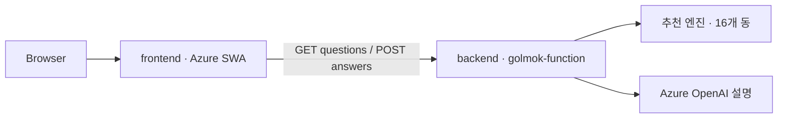

# golmok-sesac_project
골목 방패 (골방) : 데이터 기반 지역별 업종 추천 서비스

## 서비스 구조

```text
frontend/  Next.js UI 및 백엔드 API 클라이언트
backend/   Azure Functions, 추천 엔진, 모델 데이터, Azure OpenAI
notebook/  분석 및 실험 코드
```

프론트와 백엔드는 독립 패키지입니다. 각각의 폴더에서 `npm ci`를 실행하며 `node_modules`, 환경변수, lockfile을 공유하지 않습니다.



로컬 실행과 배포 환경변수는 [frontend/README.md](frontend/README.md)와 [backend/README.md](backend/README.md)를 따릅니다. 추천 로직이나 모델 데이터를 프론트로 복사하지 않습니다.

### 설치 방법
1. Windows 기준
winget install Python.Python.3.12

py -3.12 -m venv .venv

.venv\Scripts\Activate.ps1
### 만약 해당 코드서 문제 발생시
Set-ExecutionPolicy -Scope CurrentUser -ExecutionPolicy RemoteSigned
해당 라인 실행 후 다시 시도할 것

pip install -r requirements.txt

2. Mac 기준
brew install python@3.12 | Homebrew 기준, 없을 경우 사이트서 다운로드

python3.12 -m venv .venv

source .venv/bin/activate

pip install -r requirements.txt
