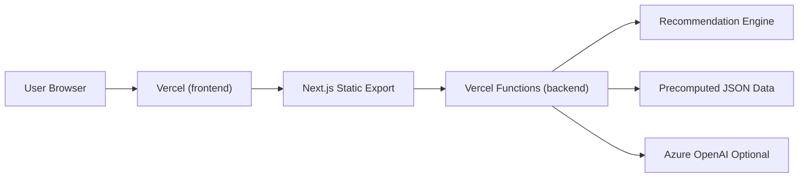

# 골목방패 Golmok Shield

골목방패는 마포구 행정동 데이터를 기반으로 카페 창업 입지를 추천하는 웹 서비스입니다.

사용자가 5개의 밸런스게임 질문에 답하면, 백엔드 추천 엔진이 사용자 선호를 9개 점수축으로 변환하고 마포구 16개 행정동 중 추천 TOP 3와 비추천 TOP 3를 제공합니다.

이 저장소의 `main` 브랜치는 최종 제출 버전입니다.

---

## 서비스 목적

카페 창업을 고민하는 사용자가 자신의 창업 성향에 맞는 지역을 빠르게 탐색할 수 있도록 돕는 것이 목표입니다.

골목방패는 단순히 한 가지 지표만으로 지역을 추천하지 않고, 사용자의 선호와 행정동별 상권 특성을 함께 비교해 추천 결과를 제공합니다.

---

## 주요 기능

* 5문항 밸런스게임 기반 사용자 선호 입력
* 사용자 답변 검증
* 사용자 선호 벡터 생성
* 마포구 16개 행정동 점수 비교
* 추천 지역 TOP 3 제공
* 비추천 지역 TOP 3 제공
* 추천/비추천 지역 지도 표시
* 동별 상세 페이지 제공
* 점수 항목별 설명 제공
* 동별 상권 리포트 제공
* Azure OpenAI 설정 시 상세 설명 생성에 활용
* Azure OpenAI 미설정 또는 실패 시 규칙 기반 설명 제공

---

## 서비스 대상 지역

현재 추천 대상은 마포구 16개 행정동입니다.

```text
공덕동
아현동
도화동
용강동
대흥동
염리동
신수동
서강동
서교동
합정동
망원1동
망원2동
연남동
성산1동
성산2동
상암동
```

---

## 추천 방식

현재 추천 엔진은 `current-feature-score-v1`입니다.

사용자의 밸런스게임 답변을 기반으로 선호 벡터를 만들고, 각 행정동의 9개 점수축과 비교해 적합도를 계산합니다.

### 추천에 사용하는 9개 점수축

```text
young_score              20·30대 적합도
middle_senior_score      중장년 수요
office_score             업무 수요
local_score              생활권 수요
trend_score              트렌드 적합도
access_score             대중교통 접근성
scale_score              상권 규모
low_competition_score    낮은 경쟁 부담
growth_score             점포 성장성
```

### 점수 계산 구조

```text
동별 적합도 85%
군집 적합도 15%
```

동별 적합도는 사용자가 선택한 선호와 각 행정동의 실제 점수 특성을 비교합니다.

군집 적합도는 해당 동이 속한 상권 군집의 평균 성향과 사용자 선호를 비교합니다.

최종 추천 결과는 추천 TOP 3, 비추천 TOP 3, 지도 표시 데이터, 군집 요약 정보를 함께 반환합니다.

---

## 기술 스택

| 구분              | 사용 기술                                                     |
| --------------- | --------------------------------------------------------- |
| Frontend        | Next.js 14, React 18, TypeScript, Tailwind CSS            |
| Backend         | Node.js, TypeScript, Vercel Serverless Functions          |
| Recommendation  | 사전 생성 JSON 데이터, feature-score 기반 추천 엔진                    |
| AI Explanation  | Azure OpenAI, rule-based fallback                         |
| Map             | Kakao Map SDK                                             |
| Data / Analysis | Python, Jupyter Notebook, pandas, scikit-learn            |
| Deployment      | Vercel (frontend / backend 프로젝트 분리)                     |

---

## 프로젝트 구조

```text
.
├── frontend/
│   ├── app/                 Next.js App Router 페이지
│   ├── components/          공통 UI 컴포넌트
│   ├── lib/                 API 클라이언트, 타입, 행정동 정보
│   ├── public/              정적 파일
│   └── tests/               프론트 계약 테스트
│
├── backend/
│   ├── api/                 Vercel Serverless Function 진입점
│   ├── src/http/            API 라우터, 핸들러, CORS 처리
│   ├── src/functions/       Azure Functions 엔드포인트 (이전 배포 구조)
│   ├── src/lib/             추천 로직, 질문, Azure OpenAI 설명 처리
│   ├── src/model/           추천 엔진
│   ├── src/data/            추천 엔진 입력 JSON 데이터
│   ├── scripts/             데이터 생성 및 점검 스크립트
│   └── tests/               백엔드 테스트
│
├── notebook/                데이터 분석 및 모델링 실험 노트북
├── docs/                    환경변수 등 문서
├── requirements.txt         Python 분석 환경 의존성
└── README.md
```

---

## 서비스 구조



프론트엔드는 추천 점수를 직접 계산하지 않습니다.

추천 질문 조회, 추천 결과 생성, 점수 설명, 동별 리포트 생성은 백엔드 API를 통해 처리합니다.

---

## API 목록

| Method | Path                           | 설명                                |
| ------ | ------------------------------ | --------------------------------- |
| GET    | `/api/recommend/questions`     | 밸런스게임 질문 목록 반환                    |
| POST   | `/api/recommend`               | 사용자 답변 기반 추천/비추천 결과 반환            |
| POST   | `/api/recommend/score-insight` | 특정 점수 항목 설명 반환                    |
| POST   | `/api/recommend/dong-report`   | 특정 동의 상세 리포트 반환                   |
| GET    | `/api/recommend/health`        | 추천 엔진, 데이터, Azure OpenAI 설정 상태 확인 |

---

## 로컬 실행 준비

### 필수 설치

```text
Node.js 20 이상
npm
```

Python 분석 노트북을 실행하려면 Python 환경도 필요합니다.

```text
Python 3.12 권장
```

---

## 백엔드 실행

```bash
cd backend
cp .env.example .env.local
npm ci
npm run verify
npm run dev
```

기본 로컬 백엔드 주소는 다음과 같습니다.

```text
http://localhost:7071
```

백엔드 주요 환경변수는 `backend/.env.example`을 기준으로 설정합니다.

```env
AZURE_OPENAI_ENDPOINT=
AZURE_OPENAI_API_KEY=
AZURE_OPENAI_DEPLOYMENT=
AZURE_OPENAI_API_VERSION=2024-10-21
AZURE_OPENAI_TIMEOUT_MS=8000
AZURE_OPENAI_MAX_RETRIES=1
RECOMMENDATION_ENGINE=current-feature-score-v1
CORS_ALLOWED_ORIGINS=http://localhost:3000,http://127.0.0.1:3000
```

Azure OpenAI 환경변수가 없어도 추천 계산과 규칙 기반 설명은 동작합니다.

---

## 프론트엔드 실행

```bash
cd frontend
cp .env.example .env.local
npm ci
npm run verify
npm run dev
```

기본 로컬 프론트엔드 주소는 다음과 같습니다.

```text
http://localhost:3000
```

프론트엔드 환경변수는 `frontend/.env.example`을 기준으로 설정합니다.

```env
NEXT_PUBLIC_API_BASE_URL=http://localhost:7071
NEXT_PUBLIC_KAKAO_MAP_KEY=
```

`NEXT_PUBLIC_API_BASE_URL`에는 백엔드 루트 URL만 넣습니다.

올바른 예:

```text
http://localhost:7071
https://golmok-function-xxxxx.koreacentral-01.azurewebsites.net
```

잘못된 예:

```text
http://localhost:7071/api
https://golmok-function-xxxxx.koreacentral-01.azurewebsites.net/api
```

프론트 코드에서 `/api/recommend/questions`, `/api/recommend` 등의 경로를 자동으로 붙입니다.

---

## 분석 노트북 실행

데이터 분석 또는 모델링 실험 노트북을 실행하려면 루트에서 Python 가상환경을 설정합니다.

### Windows

```powershell
py -3.12 -m venv .venv
.venv\Scripts\Activate.ps1
pip install -r requirements.txt
```

PowerShell 실행 정책 오류가 발생하면 아래 명령을 먼저 실행합니다.

```powershell
Set-ExecutionPolicy -Scope CurrentUser -ExecutionPolicy RemoteSigned
```

### macOS

```bash
python3.12 -m venv .venv
source .venv/bin/activate
pip install -r requirements.txt
```

---

## 테스트 및 검증

### 백엔드

```bash
cd backend
npm run typecheck
npm test
npm run build
```

전체 검증:

```bash
npm run verify
```

### 프론트엔드

```bash
cd frontend
npm run typecheck
npm test
npm run build
```

전체 검증:

```bash
npm run verify
```

---

## 배포

프론트엔드와 백엔드는 같은 GitHub 저장소를 Root Directory만 다르게 지정해 **Vercel 프로젝트 2개**로 배포합니다. `main` 브랜치에 push하면 두 프로젝트가 자동으로 다시 배포됩니다.

> 팀 프로젝트 당시에는 Azure Static Web Apps + Azure Function App으로 배포했으며, 이후 Vercel로 이전했습니다.

### Backend (Vercel 프로젝트 ①)

| 항목 | 값 |
| --- | --- |
| Root Directory | `backend` |
| Framework Preset | Other (`backend/vercel.json`에 빌드 설정 포함) |
| 환경변수 | `CORS_ALLOWED_ORIGINS=https://<프론트 도메인>` (필수), Azure OpenAI 값 (선택) |

`/api/*` 요청은 `backend/vercel.json`의 rewrite로 `backend/api/index.ts` 함수 하나에 모이고, 로컬 `devServer`와 같은 라우터(`src/http/router.ts`)를 사용합니다.

상태 확인 경로:

```text
https://<백엔드 도메인>/api/recommend/health
```

### Frontend (Vercel 프로젝트 ②)

| 항목 | 값 |
| --- | --- |
| Root Directory | `frontend` |
| Framework Preset | Next.js (자동 감지) |
| 환경변수 | `NEXT_PUBLIC_API_BASE_URL=https://<백엔드 도메인>`, `NEXT_PUBLIC_KAKAO_MAP_KEY` |

`NEXT_PUBLIC_*` 값은 빌드 시점에 반영되므로, 값을 바꾼 뒤에는 프론트 프로젝트를 다시 배포해야 합니다.

카카오맵 JavaScript 키의 **JavaScript SDK 도메인**에 프론트 배포 도메인을 등록해야 지도가 표시됩니다.

---

## 개발 및 제출 기준 주의사항

1. 추천 로직과 모델 JSON 데이터는 백엔드에서 관리합니다.
2. 프론트엔드는 추천 점수를 직접 계산하지 않고 백엔드 API 응답을 사용합니다.
3. API 응답 계약을 바꾸면 프론트 타입과 테스트도 함께 수정해야 합니다.
4. `frontend`와 `backend`는 독립 패키지입니다.
5. 각 폴더에서 별도로 `npm ci`를 실행합니다.
6. `node_modules`는 커밋하지 않습니다.
7. `.env.local`, `local.settings.json`, 실제 Azure 키 값은 커밋하지 않습니다.
8. Azure OpenAI API Key는 절대 프론트엔드 환경변수에 넣지 않습니다.
9. `NEXT_PUBLIC_` 접두사가 붙은 값은 브라우저에 노출될 수 있습니다.

---

## 제출 버전의 범위

이 프로젝트는 카페 창업 입지 추천을 위한 데이터 기반 웹 서비스입니다.

제출 버전에는 아래 기능이 포함되지 않습니다.

```text
실시간 매출 예측
임대료 예측
객단가 예측
체류시간 예측
성공 가능성 보장
실시간 데이터 수집
실시간 모델 학습
```

골목방패의 추천 결과는 보유 데이터와 사전 생성된 점수 테이블을 기반으로 한 참고용 입지 추천 결과입니다.
